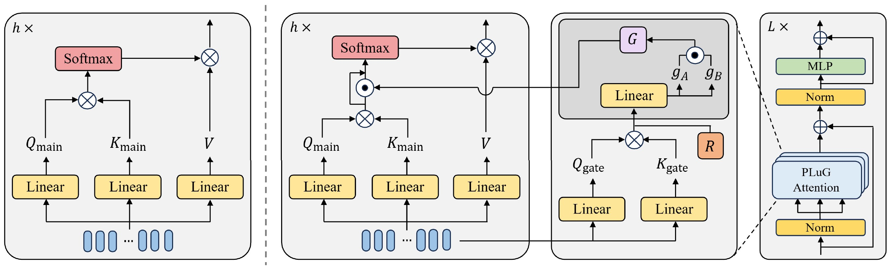

# PLuG: Pairwise Logit Gating for Expressive Attention Modulation in Vision Transformers

<p align="center">
  Dongheon Lee · Sangwoo Yoon · Seongsu Kim · Joonki Paik<br>
  Chung-Ang University
</p>

<p align="center">
  <a href="https://ieeexplore.ieee.org/document/11554332"></a>
  <a href="https://doi.org/10.1109/ACCESS.2026.3701015"></a>
</p>

This repository accompanies **PLuG**, a simple plug-in attention mechanism that learns to amplify or suppress individual query-key interactions in Vision Transformers. PLuG adds a lightweight gating path alongside standard self-attention and modulates the attention logits before softmax, enabling more expressive token-pair interactions with minimal architectural changes.

<p align="center">
  
</p>

<p align="center"><em>PLuG uses a parallel gating path to modulate each query-key attention logit before softmax.</em></p>

## Highlights

- **Token-pair-specific modulation:** independently controls the amplification and suppression of query-key interactions.
- **Plug-in design:** replaces the attention module without changing the overall Transformer architecture.
- **Broad applicability:** improves ViT-based models across image classification, semantic segmentation, and image generation.

## ImageNet-1K Results

| Model | Baseline Top-1 | + PLuG Top-1 | Gain |
|:--|:--:|:--:|--:|
| DeiT-Ti | 72.2% | **73.2%** | +1.0 |
| DeiT-S | 79.8% | **80.3%** | +0.5 |

Please refer to the [paper](https://ieeexplore.ieee.org/document/11554332) for full results and analysis.

## Environment

The experiments were conducted with:

| Dependency | Version |
|:--|:--|
| Python | 3.7 |
| CUDA | 11.6 |
| timm | 0.6.13 |

A compatible environment can be created with:

```bash
conda create -n plug python=3.7 -y
conda activate plug
pip install torch==1.13.1+cu116 torchvision==0.14.1+cu116 torchaudio==0.13.1 --extra-index-url https://download.pytorch.org/whl/cu116
pip install timm==0.6.13
```

## Training

To train PLuG-DeiT on ImageNet on a single node with 2 gpus for 300 epochs run:
DeiT-tiny
```
torchrun --nproc_per_node=2 --use_env main.py --model plug_deit_tiny --batch-size 256 --accum-iter 2 --data-path /path/to/imagenet --output_dir /path/to/save
```
DeiT-small
```
torchrun --nproc_per_node=2 --use_env main.py --model plug_deit_small --batch-size 256 --accum-iter 2 --data-path /path/to/imagenet --output_dir /path/to/save
```

## Evaluation
To evaluate a pre-trained PLuG-DeiT on ImageNet val with a single GPU run:
```
python main.py --eval --resume /path/to/pth --data-path /path/to/imagenet
```

## Citation

If you find this work useful, please cite:

```bibtex
@ARTICLE{lee2026plug,
  author={Lee, Dongheon and Yoon, Sangwoo and Kim, Seongsu and Paik, Joonki},
  journal={IEEE Access},
  title={PLuG: Pairwise Logit Gating for Expressive Attention Modulation in Vision Transformers},
  year={2026},
  volume={14},
  pages={87364--87376},
  doi={10.1109/ACCESS.2026.3701015}
}
```

## Acknowledgements

The ImageNet classification experiments build on [DeiT](https://github.com/facebookresearch/deit) and [timm](https://github.com/huggingface/pytorch-image-models).
